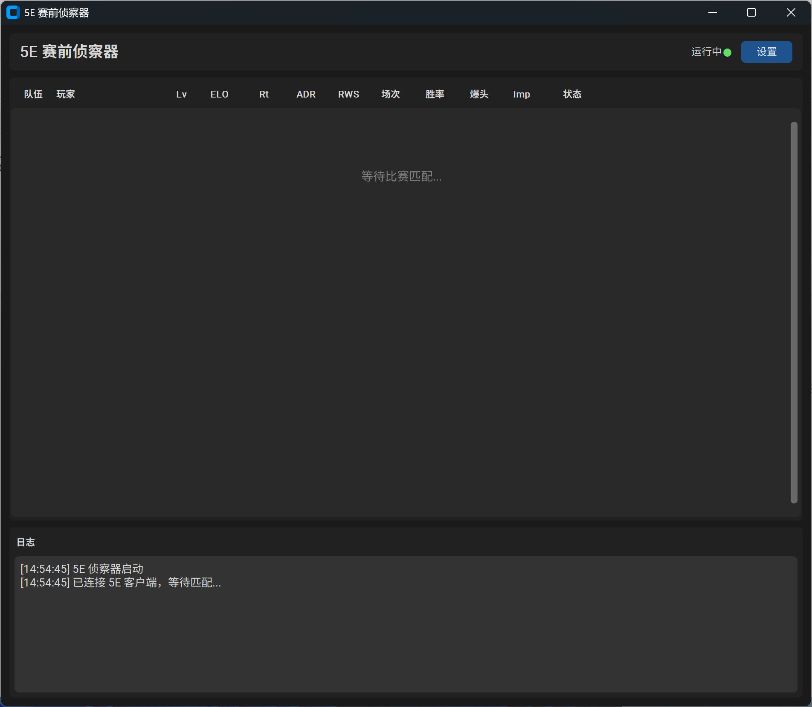

# 5E 赛前侦察器



CS2 5Eplay 平台的赛前侦察工具，通过 Chrome DevTools Protocol 自动捕获 WebSocket 对战数据，实时显示双方玩家信息。

## 功能

- 自动启动 5E 客户端并连接调试端口
- 捕获排位赛（42205234）和普通赛（39583794）的对战数据
- 实时显示双方玩家 UUID、昵称、状态等信息
- 一键复制玩家 UUID
- 设置界面可配置 5E 客户端路径和本人昵称

## 使用

直接运行 `dist\5EPreMatchScout.exe`，程序会自动拉起 5E 客户端并开始监听匹配。

## 打包

```bash
pip install -r requirements.txt
pyinstaller --onefile --noconsole --name "5EPreMatchScout" --hidden-import "websocket" --hidden-import "customtkinter" gui.py
```

## 依赖

- customtkinter
- websocket-client
- Pillow
